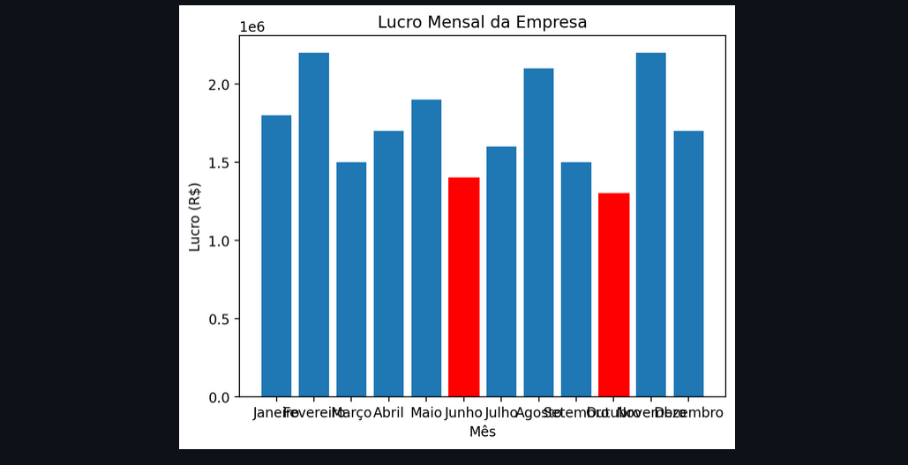

# Streamlit Dockerized App

  

  

Este repositório apresenta um aplicativo Streamlit Python containerizado com Docker. O aplicativo exibe dados fictícios de lucro mensal de uma empresa, destacando em vermelho os meses em que o faturamento não foi bom.

## Recursos

- Visualização de dados de lucro mensal da empresa.
- Destaque em vermelho para meses com baixo lucro.
- Containerizado com Docker para facilitar a implantação.

## Pré-requisitos

Antes de começar, certifique-se de ter o Docker instalado em sua máquina, bem como as depedências. 

## Dúvidas 
- Para qualquer dúvida, fale com o developer leader @felipecastro

